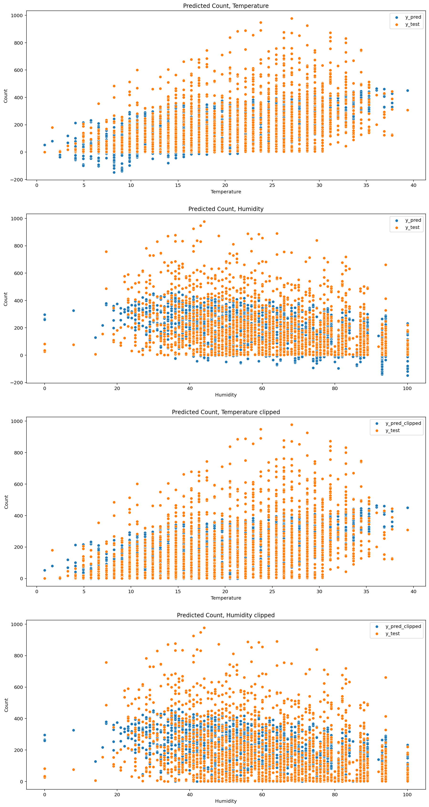
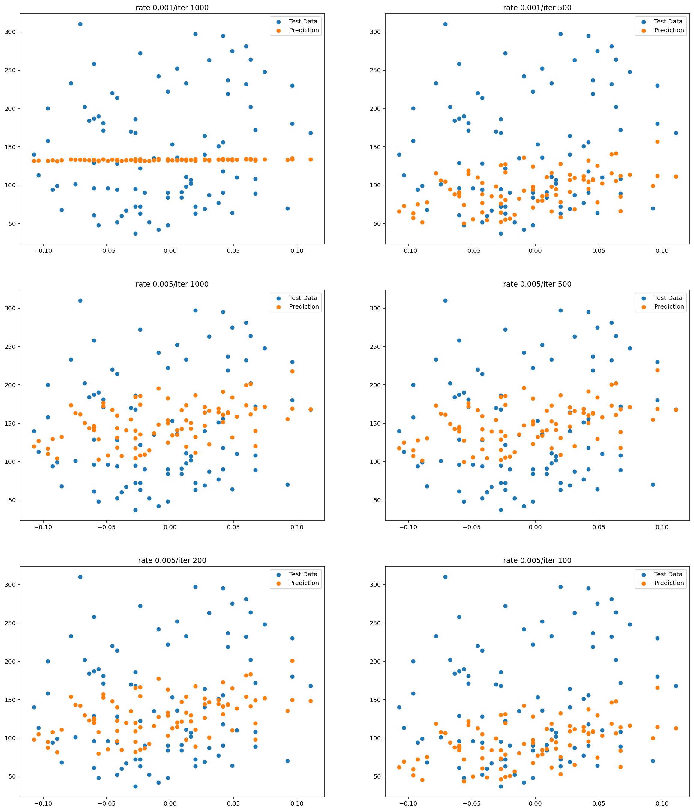

# AIFFEL Campus Online Code Peer Review Templete
- 코더 : 김영민
- 리뷰어 : 김희찬
  

# PRT(Peer Review Template)
- [O]  **1. 주어진 문제를 해결하는 완성된 코드가 제출되었나요?** 
<p>
    
    
</p>

- [O]  **2. 전체 코드에서 가장 핵심적이거나 가장 복잡하고 이해하기 어려운 부분에 작성된 
주석 또는 doc string을 보고 해당 코드가 잘 이해되었나요?**

</br>
        
- [O]  **3. 에러가 난 부분을 디버깅하여 문제를 해결한 기록을 남겼거나
새로운 시도 또는 추가 실험을 수행해봤나요?**
    

        
- [O]  **4. 회고를 잘 작성했나요?**

```
위의 상기한 방법중 feature재선정과 Clipping을 사용해 다시 예측을 진행하고 성능을 평가해 본 결과
feature재선정 전과 후의 RMSE는 각각 약 140.66, 141.03으로 근소하게 재선정 전이 성능이 좋았고,

Clipping을 진행한것은 음수값 예측이 집합의 범위를 벗어나 error를 크게할 뿐이기 때문에 RMSE가 낮아질 수 밖에 없었고
141.03에서 140.03으로 약 1가량 낮아젔다.
```
        
- [O]  **5. 코드가 간결하고 효율적인가요?**


# 회고(참고 링크 및 코드 개선)
```
mse값을 낮추기 위해 여러 실험을 돌리는 코드가 인상적이었습니다.
```
