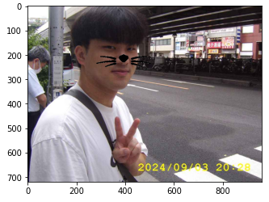
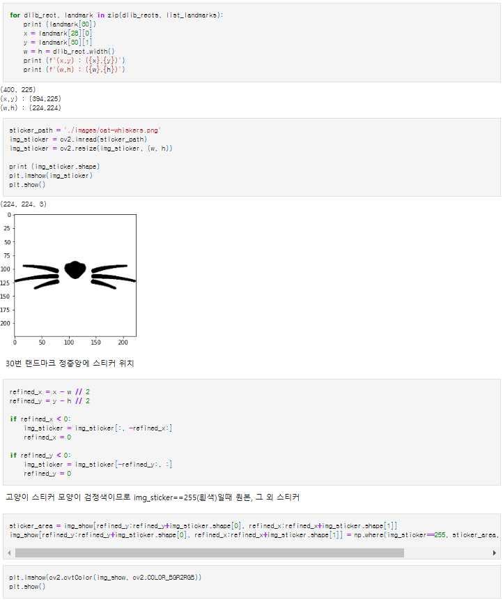
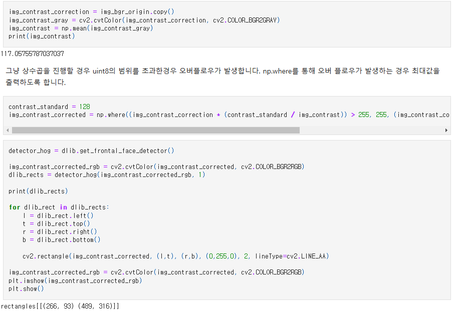
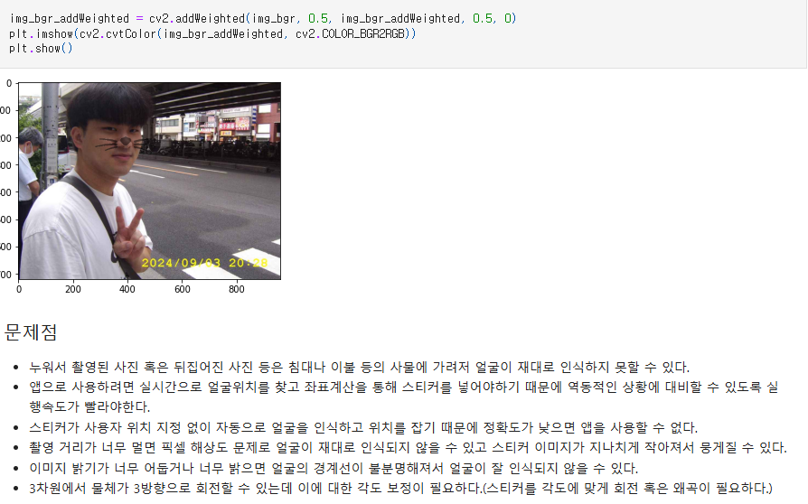
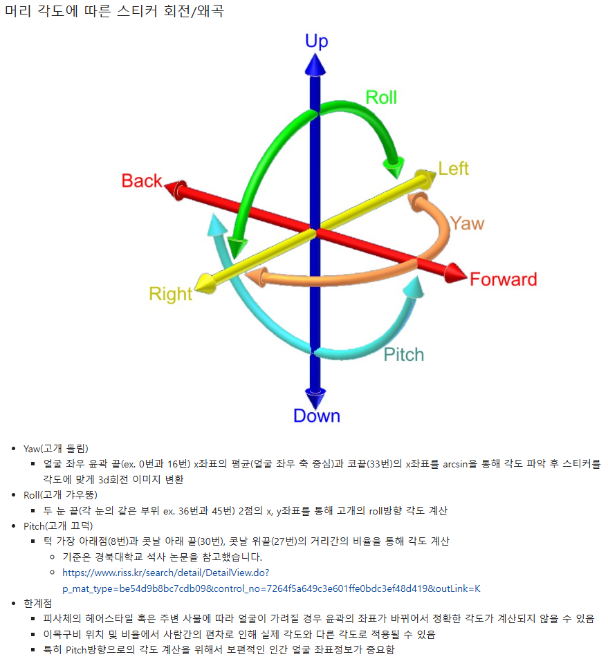
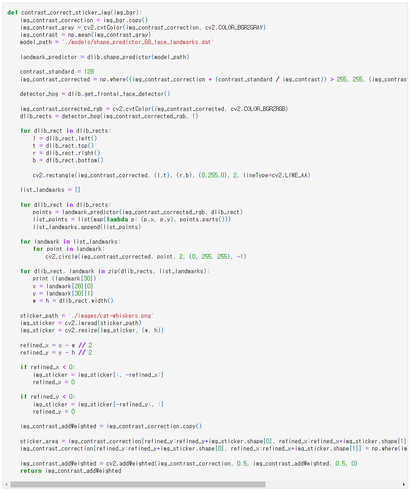
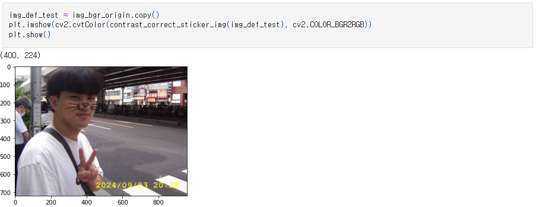

# AIFFEL Campus Online Code Peer Review Templete
- 코더 : 김영민
- 리뷰어 : 윤수영


# PRT(Peer Review Template)
- [O]  **1. 주어진 문제를 해결하는 완성된 코드가 제출되었나요?**
    - 문제에서 요구하는 최종 결과물이 첨부되었는지 확인
        - 중요! 해당 조건을 만족하는 부분을 캡쳐해 근거로 첨부

        아래 사진을 확인하면 정확한 위치에 스티커가 위치함을 알 수 있음<br /><br />
        <br /><br />
        또한 아래 사진을 통해 문제 해결 코드가 작성되어 있음을 확인<br /><br />
        <br /><br />
        
- [O]  **2. 전체 코드에서 가장 핵심적이거나 가장 복잡하고 이해하기 어려운 부분에 작성된 
주석 또는 doc string을 보고 해당 코드가 잘 이해되었나요?**
    - 해당 코드 블럭을 왜 핵심적이라고 생각하는지 확인
    - 해당 코드 블럭에 doc string/annotation이 달려 있는지 확인
    - 해당 코드의 기능, 존재 이유, 작동 원리 등을 기술했는지 확인
    - 주석을 보고 코드 이해가 잘 되었는지 확인
        - 중요! 잘 작성되었다고 생각되는 부분을 캡쳐해 근거로 첨부

        아래 사진을 통해 이미지의 밝기를 보정한 후 스티커를 적용하는 범위를 탐색하는 과정을 확인하기 쉽게 작성해놓았음을 확인<br /><br />
        <br /><br />

- [O]  **3. 에러가 난 부분을 디버깅하여 문제를 해결한 기록을 남겼거나
새로운 시도 또는 추가 실험을 수행해봤나요?**
    - 문제 원인 및 해결 과정을 잘 기록하였는지 확인
    - 프로젝트 평가 기준에 더해 추가적으로 수행한 나만의 시도, 
    실험이 기록되어 있는지 확인
        - 중요! 잘 작성되었다고 생각되는 부분을 캡쳐해 근거로 첨부

        아래 사진을 통해 문제 상황에 대하여 인식하고, 이를 이용하여 문제를 해결한 방법을 제시하고 수행하였음을 확인<br /><br />
        <br /><br />

- [O]  **4. 회고를 잘 작성했나요?**
    - 주어진 문제를 해결하는 완성된 코드 내지 프로젝트 결과물에 대해
    배운점과 아쉬운점, 느낀점 등이 기록되어 있는지 확인
    - 전체 코드 실행 플로우를 그래프로 그려서 이해를 돕고 있는지 확인
        - 중요! 잘 작성되었다고 생각되는 부분을 캡쳐해 근거로 첨부

        아래 사진을 통해 baseline 모델을 수행하고 생길 수 있는 문제점에 대한 고려와, 회고를 진행하였음을 확인<br /><br />
        <br /><br />
        또한 아래 사진을 통해 머리 각도에 따른 스티커 회전/왜곡에 대한 내용을 고찰하고, 해당 사항에 대하여 내용정리 및 한계점 등을 회고하것을 확인<br /><br />
        <br /><br />

- [O]  **5. 코드가 간결하고 효율적인가요?**
    - 파이썬 스타일 가이드 (PEP8) 를 준수하였는지 확인
    - 코드 중복을 최소화하고 범용적으로 사용할 수 있도록 함수화/모듈화했는지 확인
        - 중요! 잘 작성되었다고 생각되는 부분을 캡쳐해 근거로 첨부

        아래 사진을 확인하면, 이미지의 발기를 조절하고, 이를 기반으로 정해진 스티커를 붙이는 코드를 함수로 간편화 하였음을 확인<br /><br />
        <br /><br />
        함수 작동 및 결과<br /><br />
        <br /><br />

# 회고(참고 링크 및 코드 개선)
```
# 리뷰어의 회고를 작성합니다.
# 코드 리뷰 시 참고한 링크가 있다면 링크와 간략한 설명을 첨부합니다.
# 코드 리뷰를 통해 개선한 코드가 있다면 코드와 간략한 설명을 첨부합니다.
```
- '이미지 밝기 보정 후 스티커 적용 범위 탐색' 과정에 대하여 작동 방식을 미리 작성하는 부분이 코드 구현과 다른 사람에게 코드를 이해시키는 부분에서 모두 좋은 결과를 가져온 것으로 확인됨.
- '이미지 밝기 보정 후 스티커 적용 범위 탐색' 과정을 모두 하나의 함수로 자동화를 시켰으며, 이를 통해 다수의 시험을 한번의 수행으로 현명하게 단축시켰음.
- '머리 각도에 따른 스티커 회전/왜곡' 부분에서는 본 과정을 통해 배운 것에 그치지 않고, 심화적으로 학습하여 해당 사항을 정리한 것을 확인하였으며, 이러한 부분이 매우 큰 배울점이라고 생각함.
